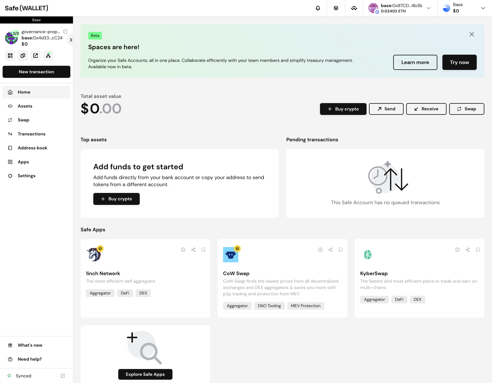
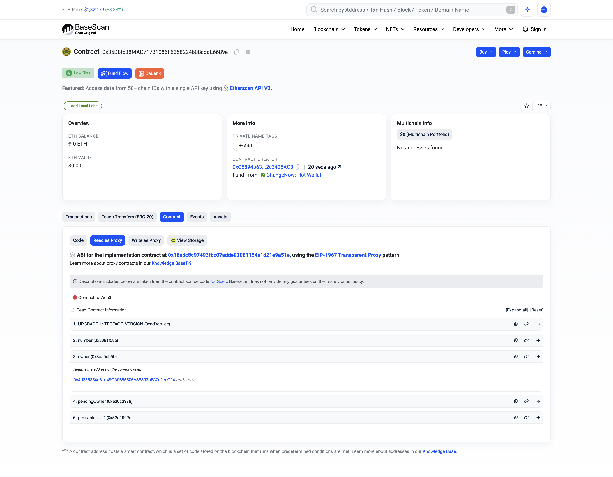
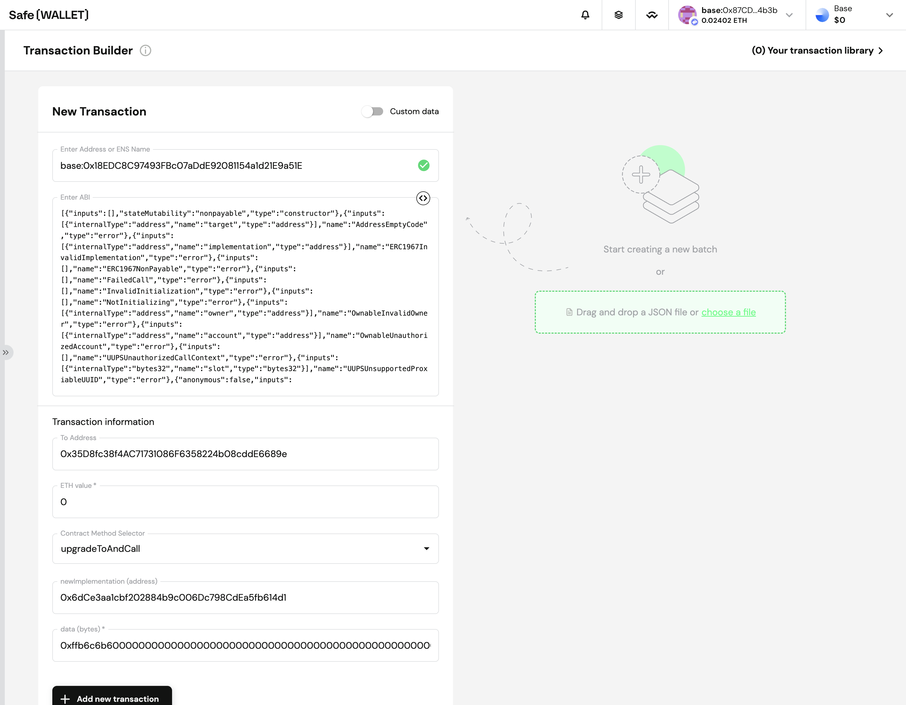
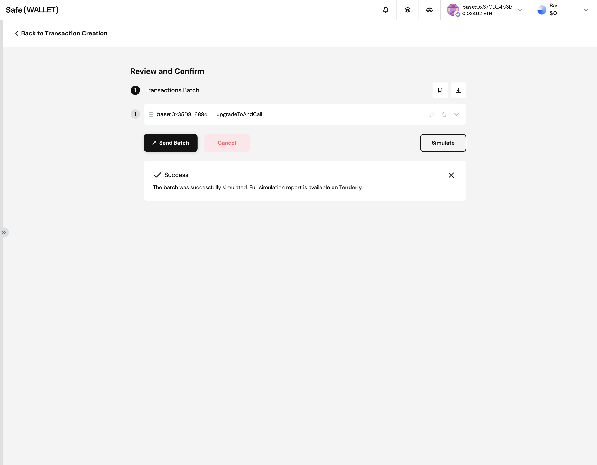
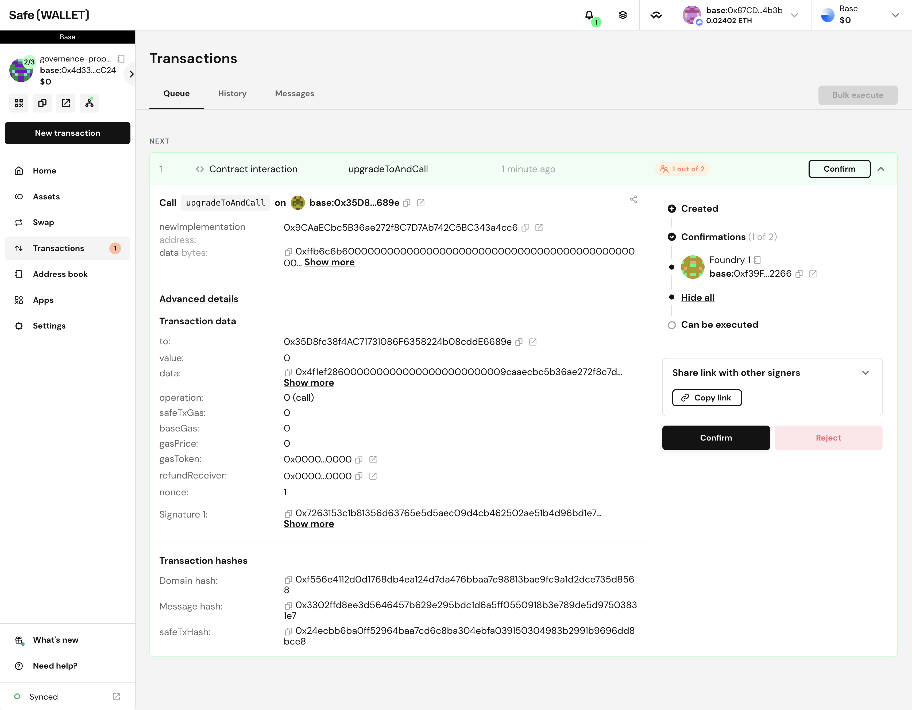
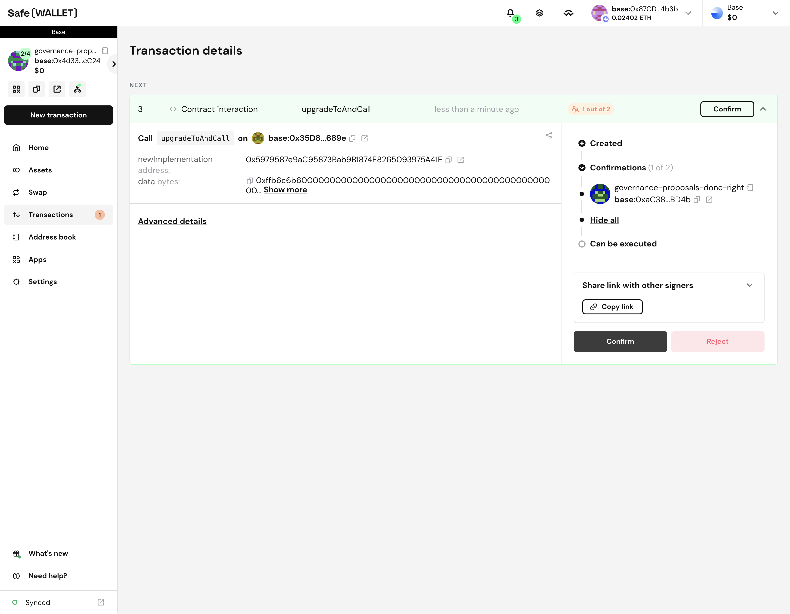

## governance-proposals-done-right

https://discord.com/events/1199312177727799336/1364279534425211031

In this Office Hours, Antonio Viggiano will go through Safe Utils and Tenderly Utils, two Foundry SDKs that can be used to schedule, validate, simulate, and execute Multisig transactions. This framework helps put security researchers closer to developers in the process of submitting governance proposal to DAOs and DeFi protocols.

## Demo

### 1. Create a Safe through the Safe UI



### 1. Deploy a `Counter` UUPSUpgradeable proxy contract with your Safe as owner

```bash
forge script script/Counter.s.sol --rpc-url base -vvvv --account $ACCOUNT --broadcast --verify
```

[Counter](https://basescan.org/address/0x35D8fc38f4AC71731086F6358224b08cddE6689e)

### 2. Go on Basescan and see you can correctly write/read from the contract



[increment tx](https://basescan.org/tx/0x8a22852c6f8175e20ce573b616b1f012fa7ca5c19be16e925eb5f266c7ccecd1)

### 3. Upgrade to `CounterV2` through a Foundry deployment + Safe UI upgrade

```bash
forge script script/CounterV2.s.sol --rpc-url base -vvvv --account $ACCOUNT --broadcast --verify
```

[CounterV2](https://basescan.org/address/0x6dCe3aa1cbf202884b9c006Dc798CdEa5fb614d1)

Encode the calldata with `cast` for example:

```bash
$ cast calldata 'reinitialize(uint256)' 2
0xffb6c6b60000000000000000000000000000000000000000000000000000000000000002
```



Optionally, Simulate on Tenderly to make sure everything is right:



[upgrade tx](https://basescan.org/tx/0x91d888c4dc23f26022fab7d8eebdc4c39a60ff63c8c3a0b26ad4bd48d240bded)

### 4. Go on Basescan and see you can correctly write/read from the v2 contract

[decrement tx](https://basescan.org/tx/0x5313e27f1cf60c9ee9c2dd790ca3ea6d09d01d91eb40a23f7a02b3d33bca25e4)

[setNumber tx](https://basescan.org/tx/0x9ba3e13b7dca7adcb84708b43f5f40729f00e338fdf0b93e86dfeeb1da43469a)

### 5. Propose an upgrade to `CounterV3` through a Foundry script using [safe-utils](https://github.com/Recon-Fuzz/safe-utils)

```bash
forge script script/ProposeSafeTxUpgradeCounterV3.s.sol --rpc-url base -vvvv --account $ACCOUNT --broadcast --verify --ffi
```



[CounterV3](https://basescan.org/address/0x9CAaECbc5B36ae272f8C7D7Ab742C5BC343a4cc6)

Approve through the Safe UI

[upgrade tx](https://basescan.org/tx/0x72ae775940a25fffd6ca38942c02174c495285d7de6e8b8b97b1f2add4eae82c)

### 6. Go on Basescan and see you can correctly write/read from the v3 contract

[multiply tx](https://basescan.org/tx/0x0fdf399eff6740f8f8f4a6c15b1be983ec2901966fdd51afb74944927c5550e3)

### 7. Propose an upgrade to `CounterV4` through a Foundry script using [safe-utils](https://github.com/Recon-Fuzz/safe-utils) and Ledger

```bash
forge script script/ProposeSafeTxUpgradeCounterV4WithLedger.s.sol --rpc-url base -vvvv --account $ACCOUNT --broadcast --verify --ffi
```



[CounterV4](https://basescan.org/address/0x5979587e9aC95873Bab9B1874E8265093975A41E)

Approve through the Safe UI

[upgrade tx](https://basescan.org/tx/0x6fa9746cb605601fa22a60b45e5ca553feb3a18af6c56f8558830588fe02eac4)

### 8. Go on Basescan and see you can correctly write/read from the v4 contract

[divide tx](https://basescan.org/tx/0xf85ccf660ed70637ba2bed002fe1dfcf633329756a3552ef6316881de432f615)